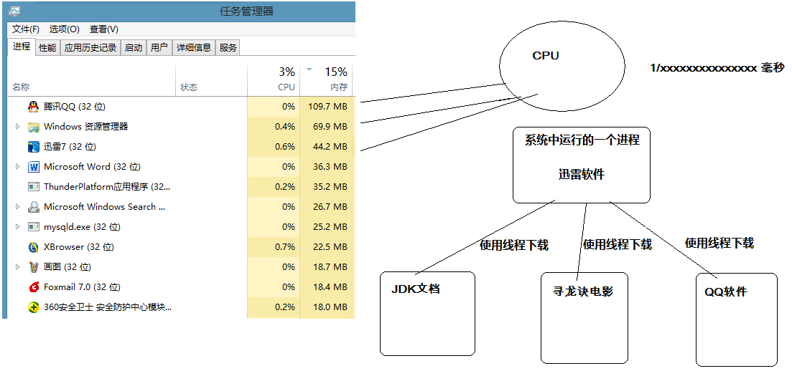
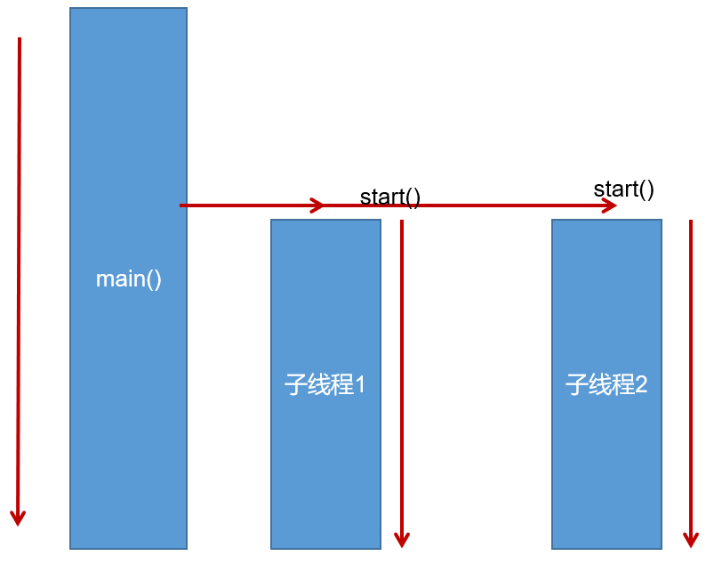

# 多线程
## 1、相关概念
### 1.1 程序、进程与线程
* **程序（program）**：为完成特定任务，用某种语言编写的`一组指令的集合`。即指`一段静态的代码`，静态对象。
* **进程（process）**：程序的一次执行过程，或是正在内存中运行的应用程序。如：运行中的QQ，运行总的网易音乐播放器。
   * 每个进程都有一个独立的内存空间，系统运行一个程序既是一个进程从创建、运行到小王的过程。（生命周期）
   * 程序是静态的，进程是动态的。
   * 进程作为`操作系统调度和分配资源的最小单元`（亦是系统运行程序的基本单元），系统在运行时会为每个进程分配不同的内存区域。
   * 现代的操作系统，大都是支持多进程的，支持同时运行多个程序。比如：我们可以一边使用编辑器，一遍使用听歌软件，同时还可以操作dos窗口等软件。
* **线程（thread）**：进程可以进一步细化为线程，是程序内部的`一条执行路径`。一个进程中至少有一个线程。
  - 一个进程同一时间若`并行`执行多个线程，就是支持多线程。
  
  - 线程作为`CPU调度和执行的最小单位`。
  - 一个进程中的多个线程共享相同的内存单元，它们从同一个堆中分配兑现个，可以访问相同的变量和对象。这就使得线程间通信更简便、高效。 但多个线程操作共享的系统资源
  可能就会带来`安全的隐患`。
  - 下图中的，红框的蓝色区域为线程独享，黄色区域为线程共享。
  
  >注意：
  >
  > 不同的进程之间是不同享内存的。
  > 
  > 进程之间的数据交换和通信的成本很高。
### 1.2查看进程和线程
我们可以在电脑底部任务栏，右键----->打开任务管理器，可以查看当前任务的进程。

1、每个应用程序的运行都是一个进程。

2、一个应用的多次运行，就是多个进程。

3、一个进程中可以包含多个线程。
> 举例
> 
> 1、聊天工具可以开发多个聊天窗口。
> 
> 2、杀毒软件可以边杀毒，边清理垃圾。
### 1.3 线程调度
- **分时调度**
  所有线程`轮流使用`CPU的使用权，并且平均分配每个线程占用CPU的时间。
- **抢占式调度**
  让`优先级高`的线程以`较大的概率`获取优先使用CPU权。如果线程优先级相同，那么就会随机选择一个（线程随机性），
  java使用的为抢占式调度。

### 1.4多线程的优点
**背景：** 以单核CPU为例，只使用单个线程先后完成多个任务（调用多个方法），肯定比用多个线程来完成用的时间更短，为何仍需要多线程呢？

**多线程程序的优点：**

1、提高应用程序的响应。对图形化界面更有意义，可增加用户体验。

2、提高计算机系统CPU的利用率。

3、改善程序结构。将既长又复杂的进程氛围多个线程，独立运行，利于理解和修改。

### 1.5 补充概念
#### 1.5.1 单核CPU和多核CPU
单核CPU，在一个时间单元内，只能执行一个线程的任务。例如，可以把CPU看成是医院的医生诊室，在一定时间内只能给一个病人诊断治疗。所以单核CPU就是，代码经过前面一系列的
前导操作（类似于医院挂号，比如有多个窗口挂号），然后到CPU处执行时发现，就只有一个CPU（对应一个医生），大家只能排队执行。

这时想要提升系统性能，只有两个办法，要么提升CPU性能（让医生看病快点），要么多加几个CPU（多安排几个医生），即为多核的CPU。

`问题，多核的效率是单核的倍数吗？`譬如4核A53的CPU，性能是单核A53的4倍吗？理论上是，但是实际上不可能，至少有两方面的损耗。

- `一个是多个核心的其他公用资源限制`。譬如，4核CPU对应的内存、cache、寄存器并没有同步扩充4倍。这就好像医院一样，1个医生换4个医生，但是做B超检查的还是一台机器，
性能瓶颈就是从医生转到B超检查了。
- `另一个是多核CPU之间的协调管理损耗`。譬如多个核心同时运行两个相关的任务，需要考虑任务同步，这也需要消耗额外性能。好比公司工作，一个人的时候只会少不用开会浪费
时间，自己跟自己商量就行了。两个人就要开会同步工作，协调分配，所以工作效率绝对不可能达到2倍。

#### 1.5.2 并行与并发

* **并行（parallel）**：指两个或多个事件在`同一时刻`发生（同时发生）。指在同一时刻内，有`多条指令`在`多个CPU`上`同时`执行。比如：多个人同事做不同的事。
 
  

  

* **并发（concurrency）**：指两个或多个事件在`同一个时间段内`发生。即在一段时间内，有`多条指令`在`单个CPU`上`快速轮换、交替`执行，使得在宏观上具有多个进程
通知执行的效果。

  

  

在操作系统中，启动多个程序，`并发`值的是在在一段时间内宏观上有多个程序同时运行，这在单核CPU系统中，每一时刻只能有一个程序执行，即微观上这些程序是分时的交替运行，
只不过是给人的感觉是同时进行，那是因为分时交替运行的时间是非常短的。

而在多核CPU系统中，则这些可以`并发`执行的程序便可以被分配到多个CPU上，实现多任务并行执行，即利用每个处理器来处理一个可以并发执行的程序，这样多个程序便可以同时执
行。目前电脑市场上说的多核CPU，便是多核处理器，核越多，`并行`处理的程序越多，能大大的提高电脑运行的效率。

## 2.创建和启动线程

### 2.1概述
- Java语言的JVM允许程序运行多个线程，使用`java.lang.Thread`类代表**线程**，所有的线程对象都必须是Thread类或其子类的实例。
- Thread类的特性
   - 每个线程都是通过某个特定Thread对象的run()方法来完成操作的，因此把run()方法体成为`线程执行体`。
   - 通过该Thread对象的start()方法来启动这个线程，而非直接调用run()。
   - 要想实现多线程，必须在主线程中创建新的线程对象。

### 2.2方式1：继承Thread类

Java通过继承Thread类来**创建**并**启动多线程**的步骤如下：

1. 定义Thread类的子类，并重写该类的run()方法，该run()方法的方法体就代表了线程需要完成任务。

2. 创建Thread子类的实例，即创建了线程对象。
3. 调用线程对象的start()方法来启动该线程。
   

>注意：
> 
> 1. 如果自己手动调用run()方法，那么就只是普通方法，没有启动多线程模式。
> 2. run()方法由JVM调用，什么时候调用，执行的过程控制都有操作系统的CPU调度决定。
> 3. 想要启动多线程，必须调用start()方法。
> 4. 一个线程对象只能调用一次start()方法启动，如果重复调用了，则将抛出以上的异常“`IllegalThreadStateException`”。

### 2.3 方式2：实现Runnable接口

Java有单继承的限制，当我们无法继承Thread类时，那么该如何做呢？在核心类库中提供了Runnable接口，我们可以实现Runnable接口，重写run()方法，然后再通过Thread类的
对象代理启动和执行我们的线程提run()方法

1. 定义Runnable接口的实现类，并重写该接口的run()方法，该run()方法的方法体同样是该线程的线程执行体。
2. 创建Runnable实现类的实例，并以此实例作为Thread的target参数来创建Thread对象，该Thread对象才是真正的线程对象。
3. 调用线程对象的start()方法，启动线程。调用Runnable接口实现类的run()方法。

通过实现Runnable接口，使得该类有了多线程类的特征。所有的分线程要执行的代码都在run方法里面。

在启动多线程的时候，需要先通过Thread类的构造方法Thread(Runnable target)构造出对象，然后调用Thread对象的start()方法来运行多线程代码。

实际上，所有的多线程代码都是通过运行Thread的start()方法来运行的。因此，不管是集成Thread类还是实现Runnable接口来实现多线程，最终还是通过Thread的对象的API来
控制线程的，熟悉Thread类的API是进行多线程编程的基础。

说明：Runnable对象仅仅作为Thread对象的target，Runnable实现类里面包含的run()方法仅作为线程执行体。而实际的线程对象依然是Thread实例，只是该Thread线程执行其
target的run()方法。


### 2.4 变形写法

**使用匿名内部类对象来实现线程的创建和启动**
> 继承Thread类方式
```java
new Thread("新的线程！"){
    @Override
    public void run() {
        for (int i = 0; i < 10; i++) {
            System.out.println(getName()+"：正在执行！"+i);
        }    
    }
}.start();
```
> 实现Runnable接口方式
```java
new Thread(new Runnable(){
    @Override
    public void run() {
        for (int i = 0; i < 10; i++) {
            System.out.println(Thread.currentThread().getName()+"：" + i);
        }    
    }
}).start();
```
### 2.5 对比两种方式

**联系**

Thread类实际上也是实现了Runnable接口的类。即
```java
public class Thread extends Object implements Runnable
```

**区别**
- 继承Thread类：线程代码存放Thread子类run方法中。
- 实现Runnable： 线程代码存在接口的实现类的run方法。

**实现Runnable接口比继承Thread类所具有的的优势**
- 避免了单继承的局限性
- 多个线程可以共享一个接口实现类的对象，非常适合多个相同线程来处理同一份资源。
- 增加程序的健壮性，实现解耦操作，代码可以被多个线程共享，代码和线程独立。

### 2.6 练习

创建两个分线程，让其中一个线程输出1-100之间的偶数，另一个线程输出1-100的奇数。


